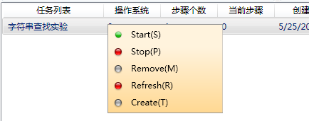

#Phenix
A cross-platforms project mimics Hadoop's MapReduce using Redis as file indexes.

- ./Phenix is server on Windows written in C#
- ./Deamon is Linux deamon program to keep ./PhenixServer running
- ./Phenix is server on Linux written in Ruby1.9
- ./Startup is the Release and Test folder like ./Startup/TestApp

This project was trying to mimic the mapreduce process and was my undergraduate thesis design.

Also, this project used part of ssh code to establish a tunnel for reverse proxy.

Running likes this:

VS C# export:

PS: This project is mirrored from Bitbucket
